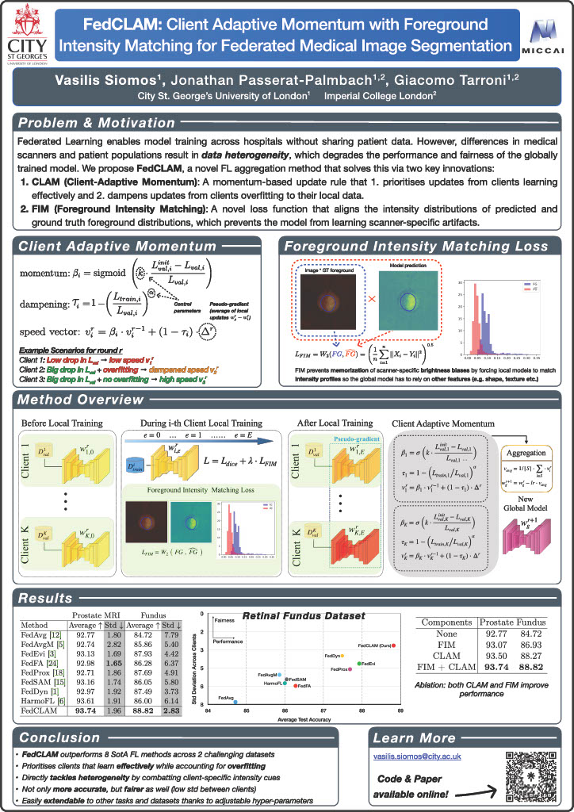

# FedCLAM: Client Adaptive Momentum with Foreground Intensity Matching for Federated Medical Image Segmentation

[](https://arxiv.org/abs/XXXX.XXXXX)
[](https://opensource.org/licenses/MIT)

Official PyTorch implementation of our MICCAI 2025 spotlight paper **FedCLAM**.
## Abstract
> Federated learning is a decentralized training approach that keeps data under stakeholder control while achieving superior performance over isolated training. While inter-institutional feature discrepancies pose a challenge in all federated settings, medical imaging is particularly affected due to diverse imaging devices and population variances, which can diminish the global model's effectiveness. Existing aggregation methods generally fail to adapt across varied circumstances. To address this, we propose FedCLAM, which integrates **client-adaptive momentum** terms derived from each client's loss reduction during local training, as well as a **personalized dampening** factor to curb overfitting. We further introduce a novel **intensity alignment loss** that matches predicted and ground-truth foreground distributions to handle heterogeneous image intensity profiles across institutions and devices. Extensive evaluations on two datasets show that FedCLAM surpasses eight cutting-edge methods in medical segmentation tasks, underscoring its efficacy.



## 📌 Key Features
- **Client-adaptive momentum-based Aggregation:** Implements client-specific momentum (`β_i`) and dampening (`τ_i`) for robust federated optimization in heterogeneous environments.
- **Intensity Alignment:** Introduces the FIM loss based on the Wasserstein distance to handle inter-site intensity heterogeneity.
- **State-of-the-Art Results:** Achieves superior performance and fairness on retinal fundus and prostate MRI segmentation tasks.
- **Minimal Tuning:** Designed to be robust and work well with default hyperparameters.

## 📋 Results

### Retinal Fundus (Optic Disc & Cup) Segmentation
| Method | Avg. Dice ↑ | Std. Dev. (Fairness) ↓ |
|:---|:---:|:---:|
| FedAvg | 84.72 | 7.79 |
| FedProx | 87.69 | 4.91 |
| FedDyn | 87.49 | 3.73 |
| **FedCLAM (Ours)** | **88.82** | **2.83** |

### Prostate MRI Segmentation
| Method | Avg. Dice ↑ | Std. Dev. (Fairness) ↓ |
|:---|:---:|:---:|
| FedAvg | 92.77 | 1.80 |
| HarmoFL | 93.61 | 1.91 |
| **FedCLAM (Ours)** | **93.74** | 1.96 |

*Please refer to the paper for detailed results per client and additional comparisons.*

---

## 🚀 Getting Started

### 1. Installation
Clone the repository and install dependencies:
```bash
git clone https://github.com/siomvas/FedCLAM.git
cd FedCLAM
pip install -r requirements.txt
```
### 2. Data Pre-processing
To use the datasets from the paper, download the original data from:
* Prostate MRI: https://liuquande.github.io/SAML/
* Retinal Fundus:
  * RIM-ONE: https://drive.google.com/file/d/1teYi_smpLiNZNJcTWdxXgKKLW2fkUQr4/view
  * REFUGE: https://figshare.com/articles/figure/Refuge/26049574?file=47095942
  * Drishti-GS: https://cvit.iiit.ac.in/projects/mip/drishti-gs/mip-dataset2/Home.php

Then replace the `base_path` and `save_path` variables in `/pyfed/dataset/preprocess_prostate.py` and `/pyfed/dataset/preprocess_fundus.py`, respectively. The file `pyfed/dataset/utils.py` also contains utilities to split the datasets into non-IID chunks using the Dirichlet method for further experimentation.

Finally, replace the `self.DIR_DATA` variable in `config/fundus/base.py` and `config/prostate_mri/base.py` with the preprocessed dataset paths (`save_path`s from previous step).

### 3. Example experiments & reproducing results from the paper
The folder `run_scripts` contains sample scripts to replicate the baseline and **FedCLAM** results presented in the paper on the prostate and fundus datasets.

---

## 🧠 Code Structure -- Modifying & Extending the Codebase
### 1. Configuration files
Every dataset needs a `base.py` configuration file which specifies training parameters as well as directories to load and save data. On top of this, for each aggregation method another configuration file specifies any method-specific parameters.
### 2. Control flow/adding a new method
The `Manager` class controls program execution, by instantiating a `Comm` (communicator) as well as `Client` objects of the relevant class/aggregation method. To add a new aggregation method, create the relevant `Client` class which specifies how the clients train locally, and the corresponding `Comm` class which specifies the aggregation rule.

---

## 🙏 Acknowledgements 
Credits to the author of FedFA (https://github.com/tfzhou/FedFA) whose code structure/scaffolding I've borrowed for this project.

---
## 📜 Citation
If you find the code and paper useful, please cite our paper which you can find here:
https://link.springer.com/chapter/10.1007/978-3-032-04978-0_24
